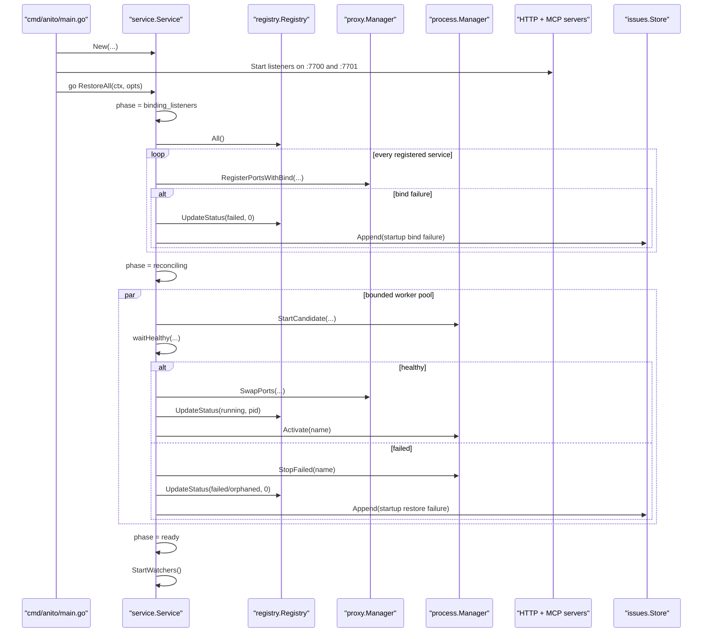

# RestoreAll Startup Reconciliation Design

AWF brief: `019f5bb3-0523-7e7c-bac0-308ea854cbde`

## Scope

This note designs a phase-1 startup reconciliation path for Anito that:

- moves daemon restore orchestration out of `cmd/anito/main.go`
- keeps stable listeners owned by the proxy before any child process is trusted
- starts the management API and MCP server before service reconciliation finishes
- blocks all service mutations until reconciliation completes
- preserves the current deploy/restart transactional model and avoids new sidecar processes

This note does not implement the design.

## Current problem

The current daemon startup loop in `cmd/anito/main.go`:

- duplicates lifecycle logic already living in `internal/service/service.go`
- restores previously running services serially
- delays API and MCP availability until all restores finish
- can report stale `running` state from the registry while the daemon is still coming up
- leaves no shared mutation gate, so the fix belongs in the service layer

The audit HTML report already calls this out as the top open reliability item.

## Goals

1. `runDaemon` becomes wiring only.
2. Restore uses the same service-layer lifecycle rules as deploy/restart.
3. Stable ports are always listener-first.
4. Startup time is bounded by concurrency waves, not a full serial sum of health timeouts.
5. Reads stay available during startup; writes do not.
6. No registry schema change is required for phase 1.

## Non-goals

- Solving cross-port atomic generation swaps in `internal/proxy/proxy.go`
- Adding dependency ordering between services
- Changing watcher semantics beyond delaying `StartWatchers()` until reconciliation finishes
- Changing `registry.ServiceStatus`

## Proposed service-layer API

Add a dedicated restore primitive in `internal/service`.

```go
type StartupPhase string

const (
	StartPhaseIdle             StartupPhase = "idle"
	StartPhaseBindingListeners StartupPhase = "binding_listeners"
	StartPhaseReconciling      StartupPhase = "reconciling"
	StartPhaseReady            StartupPhase = "ready"
)

type RestoreOutcome string

const (
	RestoreSkipped  RestoreOutcome = "skipped"
	RestoreRunning  RestoreOutcome = "running"
	RestoreStatic   RestoreOutcome = "static"
	RestoreFailed   RestoreOutcome = "failed"
	RestoreOrphaned RestoreOutcome = "orphaned"
	RestoreBindFail RestoreOutcome = "bind_failed"
)

type RestoreAllOptions struct {
	MaxParallel int
	IssueSource string
}

type RestoreServiceResult struct {
	Name          string
	PriorStatus   registry.ServiceStatus
	Outcome       RestoreOutcome
	StablePorts   map[string]int
	InternalPorts map[string]int
	PID           int
	Duration      time.Duration
	Error         string
}

type RestoreAllResult struct {
	StartedAt   time.Time
	CompletedAt time.Time
	Phase       StartupPhase
	Total       int
	Targets     int
	Restored    int
	Failed      int
	Orphaned    int
	Skipped     int
	BindFailed  int
	Services    []RestoreServiceResult
}

type StartupState struct {
	Phase            StartupPhase
	StartedAt        time.Time
	CompletedAt      time.Time
	Total            int
	Completed        int
	MaxParallel      int
	MutationsBlocked bool
	LastResult       *RestoreAllResult
}

type StartupGateError struct {
	Phase     StartupPhase
	Completed int
	Total     int
}
```

Add these methods:

```go
func (s *Service) RestoreAll(ctx context.Context, opts RestoreAllOptions) (*RestoreAllResult, error)
func (s *Service) StartupState() StartupState
```

`StartupGateError` is the single error all write paths return while startup reconciliation is active.

## Startup state model

Global state:

`idle -> binding_listeners -> reconciling -> ready`

Per-service state is carried in `RestoreServiceResult.Outcome`:

- `skipped`: service was not meant to auto-start on daemon boot
- `static`: static service proxy swapped successfully
- `running`: binary candidate passed health and was activated
- `orphaned`: binary path missing
- `bind_failed`: stable listener could not be rebound
- `failed`: start, health, swap, or activation failed

Important phase-1 choice: keep `registry.ServiceStatus` unchanged and expose startup progress separately through `StartupState`. That avoids a registry schema change just to represent a transient boot phase.

## Listener-first restore algorithm

### Phase A: bind listeners for every registered service

Input set: `reg.All()`, sorted by service name for deterministic logs and tests.

For every service with stable ports:

1. Attempt `prx.RegisterPortsWithBind(...)`.
2. If bind fails:
   - record `bind_failed`
   - update registry status to `failed`
   - append an issue
   - do not enqueue that service for process restore
3. If bind succeeds:
   - leave placeholder `503 service starting` handler active
   - proceed to phase B only if the previous persisted status was `running`

This phase is intentionally serialized. Listener registration is cheap, guarded by `proxy.Manager.mu`, and must complete before any service is allowed to claim an internal port and pass health.

### Phase B: reconcile prior running services with bounded concurrency

Queue only services whose persisted pre-shutdown status was `running`.

Worker logic for binary services:

1. Acquire the existing per-service deploy lock.
2. If `os.Stat(binaryPath)` reports missing path:
   - mark `orphaned`
   - `reg.UpdateStatus(..., registry.StatusOrphaned, 0)`
   - append an issue
   - return
3. Start with `mgr.StartCandidate(svc)`, not `mgr.Start(svc)`.
   - This keeps crash recovery suppressed until activation.
   - It also matches the transactional deploy/restart model.
4. Run `waitHealthy(...)` against the chosen health-check port.
5. On health failure:
   - `mgr.StopFailed(name)`
   - `prx.UnswapPorts(name)`
   - `reg.UpdateStatus(..., registry.StatusFailed, 0)`
   - append an issue
   - return
6. Swap listeners with `prx.SwapPorts(name, internalPorts)`.
7. Read PID, then `reg.UpdateStatus(..., registry.StatusRunning, pid)`.
8. Call `mgr.Activate(name)`.
9. Reset crash state with `reg.UpdateCrashState(name, 0, false)`.
10. Record `running`.

Worker logic for static services:

1. Acquire the per-service deploy lock.
2. `prx.SwapStatic(name, binaryPath)`
3. `reg.UpdateStatus(..., registry.StatusRunning, 0)`
4. Record `static`

### Phase C: lift the mutation gate and start watchers

After all workers finish:

1. publish final `RestoreAllResult`
2. switch startup state to `ready`
3. run `StartWatchers()`

Watchers stay delayed until `ready` so a file-change restart cannot race startup reconciliation.

## Sequence diagram



## Mutation gating

All service-layer mutators must call `ensureMutable()` first:

- `Deploy`
- `Restart`
- `Stop`
- `Rollback`
- `Remove`
- `Reserve`
- `ReservePorts`

Read-only methods remain available:

- `Services`
- `Status`
- `Metrics`
- `Logs` / `LogStream`
- `BuildLogs` / `BuildLogStream`

Transport mapping:

- HTTP: map `StartupGateError` to `409 Conflict`
- MCP: return a structured tool error with `phase`, `completed`, and `total`
- CLI: print a concise retryable message, for example: `startup reconciliation in progress (3/8 complete)`

The gate lives only in `internal/service`, so CLI, HTTP, and MCP stay thin.

## Invariants

1. Stable listeners bind before any child process is considered restorable.
2. No process is activated before its health check passes.
3. Startup restore never detaches or drains an old process because there is none after daemon restart.
4. Candidate crashes before activation must not enter normal crash-recovery backoff.
5. Mutations are globally blocked until reconciliation reaches `ready`.
6. Startup failures are isolated per service; one bad service does not stop other restores.
7. `runDaemon` owns wiring only, not service lifecycle orchestration.
8. Phase 1 does not change registry persistence shape.

## Failure matrix

| Failure point | Expected action | Registry result | Proxy result | Process result | Issue append |
| --- | --- | --- | --- | --- | --- |
| Listener bind fails | skip restore for that service | `failed` | no listener for that service | no process started | yes |
| Binary path missing | mark orphaned | `orphaned` | placeholder 503 remains | no process started | yes |
| Static path invalid / static swap fails | fail restore | `failed` | placeholder 503 remains | n/a | yes |
| `StartCandidate` fails | fail restore | `failed` | placeholder 503 remains | no live process | yes |
| Candidate exits during health wait | treat as failed | `failed` | placeholder 503 remains | stopped or already exited | yes |
| Health timeout / non-200 | `StopFailed` | `failed` | placeholder 503 remains | candidate terminated | yes |
| Proxy swap fails | `StopFailed` | `failed` | placeholder 503 remains | candidate terminated | yes |
| PID missing before activation | fail restore | `failed` | placeholder 503 remains | candidate considered dead | yes |
| `Activate` fails | fail restore and stop candidate if still alive | `failed` | placeholder 503 remains | candidate terminated | yes |
| Issue append fails | log only | primary outcome unchanged | unchanged | unchanged | best effort |

Notes:

- Binding failure is service-local. The daemon still reaches `ready`.
- Placeholder 503 is the correct failure mode because the proxy still owns the stable port invariant.

## Concurrency bounds

- Default `MaxParallel`: `4`
- Effective worker count: `min(max(1, opts.MaxParallel), len(targets))`
- Phase A listener binding stays single-threaded.
- Phase B restores run in the worker pool.
- Each worker holds at most one service deploy lock.
- No worker should block another service on registry reads; only point updates take the registry mutex.

Why `4`:

- it collapses worst-case startup from `N * timeout` to `ceil(N/4) * timeout`
- it avoids launching a large number of local builds or runtimes at once
- it is small enough to keep logs, CPU, and port churn readable during failure storms

This should remain an option, not a config-file field, for phase 1.

## Read-path behavior during startup

Because the registry may still contain the previous run's `running` entries while reconciliation is in progress, callers need an explicit startup snapshot.

Phase-1 recommendation:

- add `Service.StartupState()`
- expose it on a small read-only API surface
- do not redefine `registry.ServiceStatus`

Minimal external shape:

```go
type StartupStatusResponse struct {
	Phase            string `json:"phase"`
	StartedAt        string `json:"started_at,omitempty"`
	CompletedAt      string `json:"completed_at,omitempty"`
	Total            int    `json:"total"`
	Completed        int    `json:"completed"`
	MutationsBlocked bool   `json:"mutations_blocked"`
}
```

That is enough for the dashboard, CLI, or MCP client to distinguish "daemon is up but reconciliation is still in progress" from "daemon is fully ready."

## Test matrix

| Test | Package | Coverage target |
| --- | --- | --- |
| `RestoreAll` binds all listeners before any worker starts | `internal/service` | prove listener-first ordering with a fake proxy manager or injected hooks |
| Startup gate blocks `Deploy` during reconcile | `internal/service` | returned `StartupGateError` |
| Read methods remain callable during reconcile | `internal/service` | `Services`, `Status`, `Metrics`, `Logs` |
| Prior `running` binary restores successfully | `internal/service` integration | status `running`, PID set, proxy swapped |
| Prior `running` binary with missing path becomes orphaned | `internal/service` | status `orphaned` |
| Health timeout leaves placeholder 503 and failed status | `internal/service` integration | `mgr.StopFailed` path |
| Proxy bind failure marks only that service failed and continues others | `internal/service` | partial startup progress |
| Concurrency bound respected | `internal/service` | max active workers never exceeds option |
| Watchers start only after global `ready` | `internal/service` | no restart callback during reconcile |
| `runDaemon` starts API/MCP before restore completes | `cmd/anito` integration | liveness reachable while startup state is blocked |
| Transport mapping returns 409 / structured tool error | `internal/server`, `internal/mcp` | only if startup state endpoint/error mapping is implemented in phase 1 |

## Exact file boundaries

Required production edits for implementation:

1. `cmd/anito/main.go`
   - delete the inline restore loop
   - construct `service.Service` before starting HTTP and MCP
   - start HTTP and MCP listeners immediately
   - launch `svc.RestoreAll(...)` in a goroutine

2. `internal/service/restore.go` (new)
   - `RestoreAll`
   - worker-pool orchestration
   - per-service restore helpers
   - issue-recording helper for startup failures

3. `internal/service/startup_state.go` (new)
   - `StartupPhase`
   - `StartupState`
   - `StartupGateError`
   - gate bookkeeping and `ensureMutable()`

4. `internal/service/service.go`
   - add `ensureMutable()` calls to all mutators
   - keep `StartWatchers()` as the post-reconcile entry point
   - optionally move `WaitHealthy` helper next to restore helpers for cohesion

5. `internal/service/restore_test.go` (new)
   - startup reconciliation unit and integration tests

Optional phase-1 read surface:

6. `internal/server/server.go`
   - add a read-only startup status endpoint or include startup state in an existing health/status payload

7. `internal/mcp/mcp.go`
   - expose startup state or map `StartupGateError` into structured tool errors

Deliberately unchanged in phase 1:

- `internal/process/process.go`: existing candidate lifecycle is sufficient
- `internal/proxy/proxy.go`: no attempt here to solve multi-port atomic generations
- `internal/registry/registry.go`: no schema or status-enum change required

If `internal/server/server.go` or `internal/mcp/mcp.go` gains new response fields or endpoints, that is a material API change and must be reflected in `CHANGELOG.md` during implementation.

## Recommended implementation order

1. Add startup gate types and `ensureMutable()`.
2. Move restore logic into `internal/service/restore.go`.
3. Refactor `runDaemon` to start servers first and call `RestoreAll`.
4. Add service-level tests for listener-first ordering, gating, and concurrency.
5. Add optional transport exposure for startup state.

## Decision summary

The right phase-1 move is a listener-first, service-owned `RestoreAll` with a global mutation gate. It fixes the current architecture leak without changing the single-binary model, the stable-port contract, or the persisted registry schema, and it gives Anito an implementation path that is consistent with the existing transactional deploy/restart machinery.
